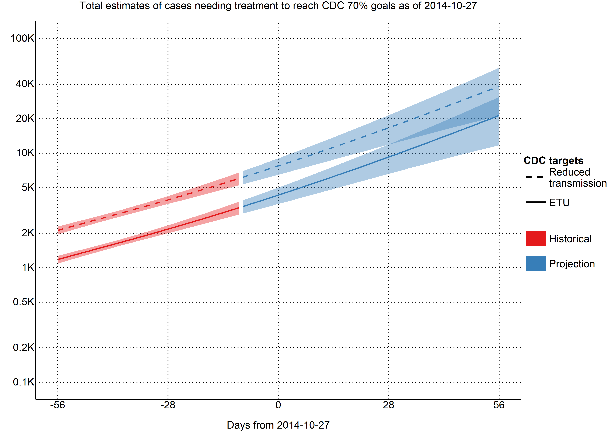
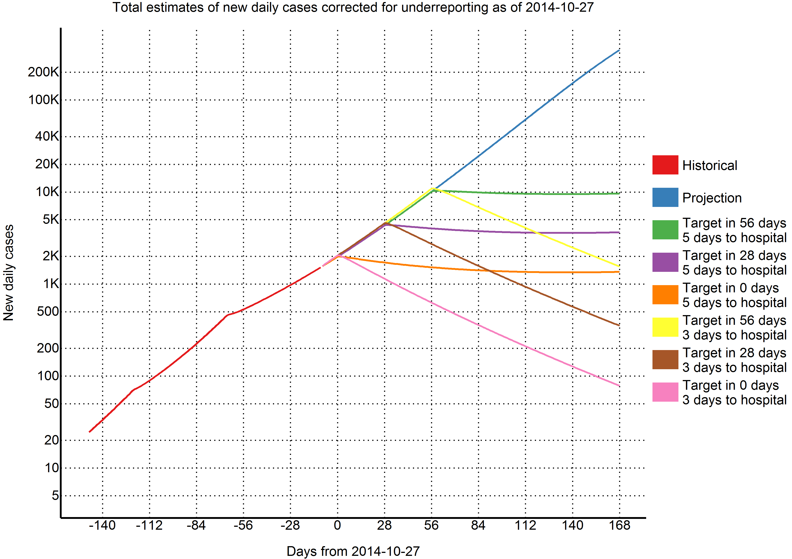
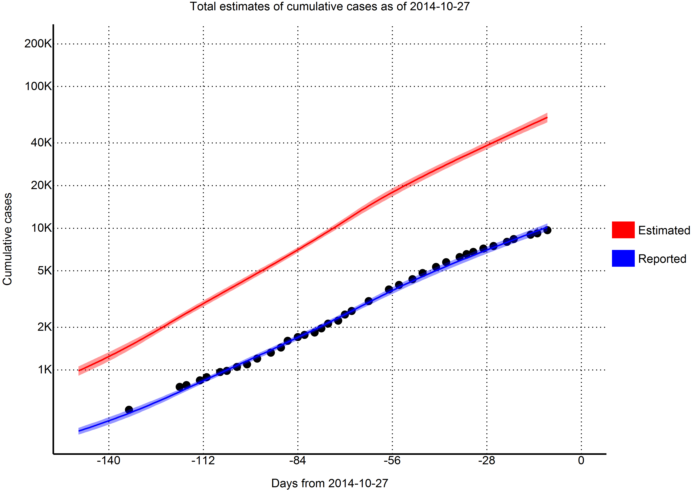

Executive summary
====================
We developed a compartmental SEIR model to forecast the progression of the West Africa EVD epidemic using a flexible mathematical model (previously used in predicting a Marburg hemorrhagic fever outbreak) that allowed the reproductive number to change every 58 days. For the purposes of our models, we considered all confirmed, suspected, or probable cases to be EVD cases. We used cases from Guinea (2014-03-22 to 2014-10-17), Liberia (2014-03-27 to 2014-10-17), and Sierra Leone (2014-05-27 to 2014-10-17), and implemented different models for each country.

Average times spent in each compartment/transition rates were taken from the recently published WHO Ebola Response Team model. The reporting quotient on 2014-08-25 was established as 1/2.5=40% by the US Centers for Disease Control and Prevention's (CDC) report. We assumed that reporting quotient on 2014-03-22 was 1/1.5=67%. We then fit an exponentially decreasing time-dependent curve between the two points and extrapolated forward.

The CDC's widely reported model estimated that to stem the tide of the epidemic 25% of all patients must be placed in Ebola Treatment Units (ETUs) and 45% must be at home or in a community setting such that there is a reduced risk for disease transmission. As of today (2014-10-27), we estimate that there are 2007 (95% CI=1700 to 2314) EVD active cases in treatment, with an additional 15202 (95% CI=12406 to 17998) EVD cases unreported and untreated. To reach the CDC targets today, we need 4302 (95% CI=3599 to 5006) cases in ETUs and 7744 (95% CI=6478 to 9010) at home or in a community setting such that there is a reduced risk for disease transmission. In 28 days (2014-11-24), we will need 9254 (95% CI=6593 to 11915) EVD cases in ETUs and 16657 (95% CI=11868 to 21446) EVD cases at reduced risk of transmission. In a further 28 days (2014-12-22) we will need 21292 (95% CI=11707 to 30878) EVD cases in ETUs and 38326 (95% CI=21073 to 55580) cases at reduced risk of transmission.

With every month the CDC's 70% target grows exponentially while the healthcare workers needed to reverse this epidemic continue to die. Urgent action is needed by the international community to reverse this crisis.

The study has a number of limitations. Firstly, we have no evidence that our exponentially decreasing reporting quotient is accurate. Furthermore, we assume that it is consistent across countries, which we know is not true. We modeled the outbreaks at the national level, while it is well known that the outbreaks are heterogeneous within each country. We assumed that all reported cases came from people who were then immediately treated and not infectious. We did not account for variations between healthcare workers and non-healthcare workers, nor did we account for infectious corpses.

Tables
===================

Table 1. Reported cases per day

|             Variable              |  2014-10-27  |   2014-11-24   |   2014-12-22   |
|:---------------------------------:|:------------:|:--------------:|:--------------:|
|          Days from today          |      0       |       28       |       56       |
|                                   |      -       |       -        |       -        |
|         Cases (reported)          |    12455     |     21957      |     39750      |
|                                   |(11534, 13375)| (18799, 25114) | (29477, 50023) |
|                                   |      -       |       -        |       -        |
|    New daily cases (reported)     |     248      |      447       |      859       |
|                                   |      -       |       -        |       -        |
|           Cases (total)           |    78289     |     162892     |     355417     |
|                                   |(70470, 86107)|(131130, 194655)|(236332, 474503)|
|                                   |      -       |       -        |       -        |
|      New daily cases (total)      |     1974     |      4324      |     10083      |
|                                   |      -       |       -        |       -        |
|         Incubation period         |    22804     |     50019      |     116745     |
|                                   |(17883, 27725)| (32039, 67999) |(53550, 179940) |
|                                   |      -       |       -        |       -        |
|     Infectious and unreported     |    15202     |     33384      |     78164      |
|                                   |(12406, 17998)| (22788, 43979) |(39945, 116383) |
|                                   |      -       |       -        |       -        |
|       Undergoing treatment        |     2007     |      3632      |      7006      |
|                                   | (1700, 2314) |  (2629, 4634)  | (3946, 10066)  |
|                                   |      -       |       -        |       -        |
|        CDC 25% ETU target         |     4302     |      9254      |     21292      |
|                                   | (3599, 5006) | (6593, 11915)  | (11707, 30878) |
|                                   |      -       |       -        |       -        |
|CDC 45% reduced transmission target|     7744     |     16657      |     38326      |
|                                   | (6478, 9010) | (11868, 21446) | (21073, 55580) |
|                                   |      -       |       -        |       -        |
|        Reporting quotient         |     30%      |      26%       |      22%       |

Figures
====================

Introduction
====================

West Africa is currently in the grips of the worst Ebola Virus Disease (EVD) epidemic in history. It has reached nearly 10,000 reported cases and is reported to have claimed nearly 5000 lives. Schools have been closed down, air traffic has been restricted, and tourism and trade has been decimated - the cost to these developing countries will most likely be felt for years to come.

The international response to this crisis has been widely criticized as slow and underwhelming. Recently, the US Centers for Disease Control and Prevention (CDC) published a widely reported model, estimating that 25% of all patients must be placed in Ebola Treatment Units (ETUs) and 45% must be at home or in a community setting such that there is a reduced risk for disease transmission, to stem the tide of the epidemic.

While multiple efforts have been made to model and forecast the epidemic, none have explicitly quantified the number of treatment places necessary to achieve the 70% target set by the CDC. We use a flexible mathematical model (previously used to model Marburg hemorrhagic fever) to estimate the number of treatment places needed to obtain the 70% target set by the CDC over the next two months (from 2014-10-27 to 2014-11-24). We hope that these estimates will provide firmer targets for the international response.

Methods
====================

Outbreak Data
---------------------

As has been common with previous EVD models, we used the public data released by the World Health Organization. For the purposes of our models, we considered all confirmed, suspected, or probable cases to be EVD cases. We used cases from Guinea (2014-03-22 to 2014-10-17), Liberia (2014-03-27 to 2014-10-17), and Sierra Leone (2014-05-27 to 2014-10-17).

Model
---------------------

We developed a compartmental model to describe the outbreaks in the three affected countries. Briefly, the population is divided into six compartments, with average rates and average time periods taken from the recently published WHO Ebola Response Team model.

Susceptible individuals (S) may become Exposed (E) after contact with infectious material. After an average of 11.4 days ($\tau_a$), Exposed persons (E) then transition into non-reported Infected persons (I). Infected persons (I) may become Treated (T) after an average of 5 days ($\tau_{I \rightarrow T}$) (in which case they are registered as an EVD case and become non-infectious), or they may Recover (R) after an average of 5+11.8 days ($\tau_{I \rightarrow R}$), or Die (D) after an average of 5+4.2 days ($\tau_{I \rightarrow D}$). Treated (T) persons may either Recover (TR) after an average of 11.8 days ($\tau_{T \rightarrow TR}$) or Die (TD) after an average of 4.2 days ($\tau_{T \rightarrow TD}$). The case fatality rate was taken to be 70%.

Probability of Infected persons (I) becoming Treated (T) ($P_T$) was time dependent: on 2014-03-22, the reporting quotient was set to 1/1.5=67%. Taken from the recently published CDC model, the reporting quotient was set to 1/2.5=40%. These percentages were then transformed into logit form, squared, and a linear regression was fit to estimate an exponentially decreasing reporting quotient over time.

A separate model was fit for each of the three countries.
 
In mathematical terms, the transition equations describing the model are given as:

$$
\frac{dS}{dt}=-\frac{\beta I S}{N}
$$

$$
\frac{dE}{dt}=\frac{\beta I S}{N} - aE
$$

$$
\frac{dI}{dt}=aE - (\gamma_{I \rightarrow R}I)
$$

$$
\frac{dR}{dt}=\gamma_{I \rightarrow R}I
$$

$$
\frac{dD}{dt}=\gamma_{I \rightarrow D}I
$$

$$
\frac{dT}{dt}=\gamma_{I \rightarrow T}I - (\gamma_{T \rightarrow TR} + \gamma_{T \rightarrow TD})T
$$

$$
\frac{dTR}{dt}=\gamma_{T \rightarrow TR}T
$$

$$
\frac{dTD}{dt}=\gamma_{T \rightarrow TD}T
$$

Where

$$
a = \frac{1}{\tau_a}
$$

$$
\tau_{I \rightarrow} = (1-P_T) \times 0.3 \times \tau_{I \rightarrow R} + (1-P_T) \times 0.7 \times \tau_{I \rightarrow D} + P_T \tau_{I \rightarrow T}
$$

$$
\gamma_{I \rightarrow} = \frac{1}{\tau_{I \rightarrow}}
$$

$$
\gamma_{I \rightarrow R} = \gamma_{I \rightarrow} \frac{(1-P_T)\times 0.3 \times \tau_{I \rightarrow R}}{\tau_{I \rightarrow}}
$$

$$
\gamma_{I \rightarrow D} = \gamma_{I \rightarrow} \frac{(1-P_T)\times 0.7 \times \tau_{I \rightarrow D}}{\tau_{I \rightarrow}}
$$

$$
\gamma_{I \rightarrow T} = \gamma_{I \rightarrow} \frac{P_T\tau_{I \rightarrow T}}{\tau_{I \rightarrow}}
$$

$$
\tau_{T \rightarrow} = 0.3 \tau_{T \rightarrow TR} + 0.7 \tau_{T \rightarrow TD}
$$

$$
\gamma_{T \rightarrow} = \frac{1}{\tau_{T \rightarrow}}
$$

$$
\gamma_{T \rightarrow TR} = \gamma_{T \rightarrow} \frac{0.3 \tau_{T \rightarrow TR}}{\tau_{T \rightarrow}}
$$

$$
\gamma_{T \rightarrow TD} = \gamma_{T \rightarrow} \frac{0.7 \tau_{T \rightarrow TD}}{\tau_{T \rightarrow}}
$$

$$
\beta = R0 \gamma_{I \rightarrow}
$$

Model Fitting
---------------------

To estimate R0 and beginning starting values for the number of persons in compartments E and I, we implemented an ensemble trajectory model with parameters allowed to change every 2*28=56 days. Briefly, a matrix of plausible parameter values were generated (R0=1.2, 1.3, ..., 2.4; E=2, 12, ..., 82; I=2, 12, ..., 82). For each parameter combination ($\Gamma$), the above model was fitted for the first 56 days. We then evaluated the fit of the model using the following formula:

$$
ldpp(\Gamma)=\frac{1}{N} \sum_{i=1}^N |Obs_i-Est_i |
$$

Where $Obs_i$ was the observed cumulative number of cases at data point i, and $Est_i$ was the estimated cumulative number of cases at data point i.

From this, we calculated the probability that the outbreak was caused by each parameter combination:

$$
P(outbreak was caused by \Gamma) =  \frac{1}{C}exp \left(- \frac{lddp(\Gamma)-min(lddp(\Gamma)}{2 \sigma^2} \right)
$$

Where C was a normalisation constant, and $\sigma=sqrt(0.2 \times (lddp(\Gamma)-min(lddp(\Gamma)))$

For each parameter combination that had a non-zero probability in the first 58 days of the outbreak, we fitted another 13 models (R0=1.2, 1.3, ..., 2.4) and repeated the same procedure. This algorithm was run until it reached the end of the reported data, at which point the probability of the outbreak being caused by each trajectory was calculated. Each trajectory was then forecast to the present day (2014-10-27) and 58 days beyond, with estimated probabilities assigned.

To obtain estimates for each compartment, the differential equations listed above were solved using the "lsoda" function in R (version 3.1.1). From the compartmental model, we extracted the number of estimated cases, new estimated cases each day, estimated reported cases, new estimated reported cases each day, exposed persons currently in the incubation period, EVD cases currently in treatment and non-infectious, and EVD cases currently unreported and infectious in the community.

Intervention
---------------------
We implemented a simpler version of the CDC's recommendations to test their efficacy; we investigated the impact of 70% of infectious EVD cases receiving treatment after 5 and 3 days on average, with this scenario occurring today (1974), in 28 days (2014-11-24), and in 56 days (2014-12-22). This is in contrast to the baseline projection where a time-dependent proportion of EVD cases ($P_T$) are treated after an average of 5 days.

Results
====================

Model Fit
---------------------

From a visual observation, the model fit is sufficient. There is some uncertainty and lackluster fit at the beginning (especially for Guinea), but the model can be considered to fit well in the last two months of data, which is the most crucial area.

Reproductive number
---------------------

Using the last 56 days of outbreak data, we estimated that the current effective reproductive number was 1.81 (95% CI=1.37 to 2.25) in Guinea, 1.27 (95% CI=1.14 to 1.41) in Liberia, and 1.81 (95% CI=1.65 to 1.96) in Sierra Leone.

Predictions
---------------------

Per today (2014-10-27), we have estimated that there are 1974 new cases every day. In 28 days (2014-11-24) this number will increase to 4324 new cases every day, corresponding to a total of 139469 (116629, 162310) cumulative total cases. In a further 28 days (2014-12-22) this will increase to 10083 new cases every day, corresponding to a total of 283622 (205447, 361796) cumulative total cases.

Achieving CDC targets for 70% containment
---------------------

As of today (2014-10-27), we estimate that there are 2007 (95% CI=1700 to 2314) EVD active cases in treatment, with an additional 15202 (95% CI=12406 to 17998) EVD cases unreported and untreated. To reach the CDC targets today, we need 4302 (95% CI=3599 to 5006) cases in ETUs and 7744 (95% CI=6478 to 9010) at home or in a community setting such that there is a reduced risk for disease transmission. In 28 days (2014-11-24), we will need 9254 (95% CI=6593 to 11915) EVD cases in ETUs and 16657 (95% CI=11868 to 21446) EVD cases at reduced risk of transmission. In a further 28 days (2014-12-22) we will need 21292 (95% CI=11707 to 30878) EVD cases in ETUs and 38326 (95% CI=21073 to 55580) cases at reduced risk of transmission.

Intervention
---------------------

Conclusion
====================

Our numbers are not incongruent with those given by the WHO model, who predicted approximately 80000 cases by the end of November. Our model explicitly models a decrease in the reporting quotient, whereas the WHO model did not. Thus, our reported estimates of approximately 24000 should lie below, and our corrected estimates of approximately 185000 should lie above. Our aggregate estimates of the countries are similar to a recent model by independent researchers, who predicted approximately 170000 cases by the end of December 2014 in Libera, 45000 cases by the end of December 2014 in Sierra Leone, and an overall R0 of 2.22. However, we predicted that the majority of cases will come from Sierra Leone (148472) instead of Liberia (75249). This is primarily due to our use of later data, where the underreporting in Liberia has severe impacts on our model. As we apply a universal underreporting correction across all countries, we are not able to quantify this.
(http://currents.plos.org/outbreaks/article/obk-14-0043-modeling-the-impact-of-interventions-on-an-epidemic-of-ebola-in-sierra-leone-and-liberia/).

This study has a number of limitations. First and foremost, we model at the country level. This masks many geographical variations that may be happening at a more discrete level. Secondly, we assume that registered cases are in treatment and thus non-infectious. While it was assumed by the WHO model that hospitalised cases were non-infectious, it is well documented that healthcare workers are continually being infected (although it has been noted that the majority of the healthcare workers were infected at home or in their local community). We are also uncertain as to our assumption that registered cases are in treatment; considering the overwhelmed nature of the West African health system. It is entirely likely that a great number of the new cases come from counting dead bodies. In addition, this model is based on reported case data, which has significant underreporting that varies over time and geographical region. Our model attempts to correct for underreporting, however, it is not possible to validate how accurately we have done so. Finally, our model assumes that the outbreak will continue growing as it has in the past - while unlikely, the recent international efforts may have had some effect that will take place in the near future.

Currently we need to treat 12047 cases to achieve the CDC's target. In one month, 25911 cases. In two months, 59619 cases. With every month the CDC's 70% target grows exponentially, while the healthcare workers needed to reverse this epidemic continue to die. Urgent action is needed by the international community to reverse this crisis.

